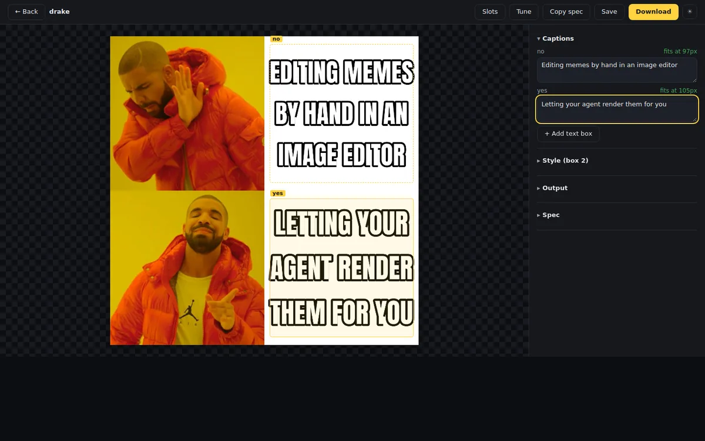
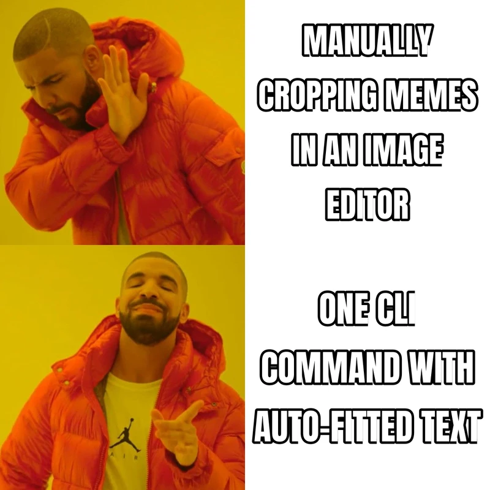
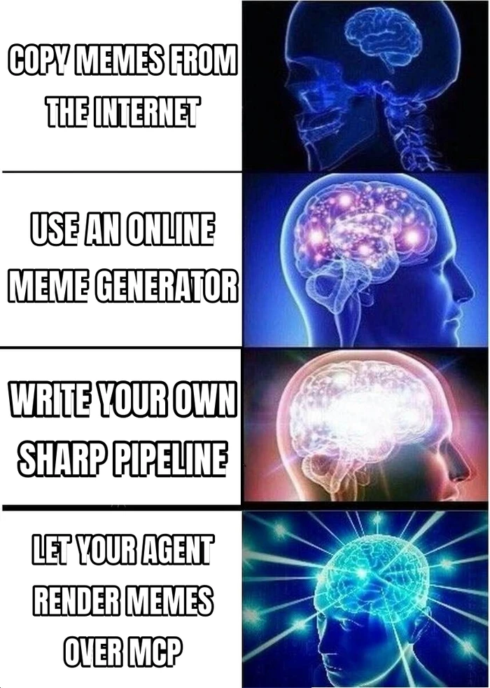
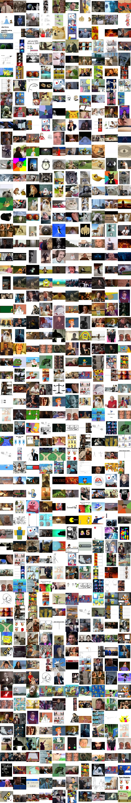
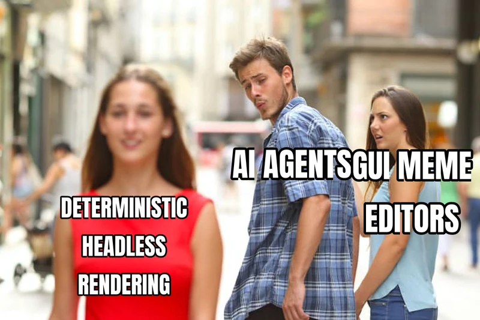
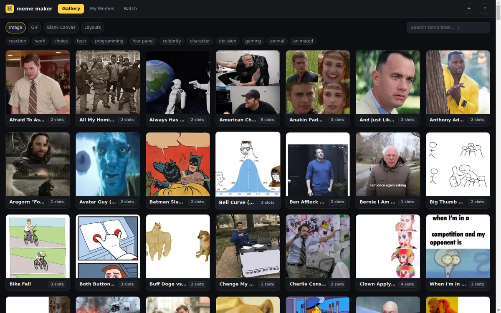
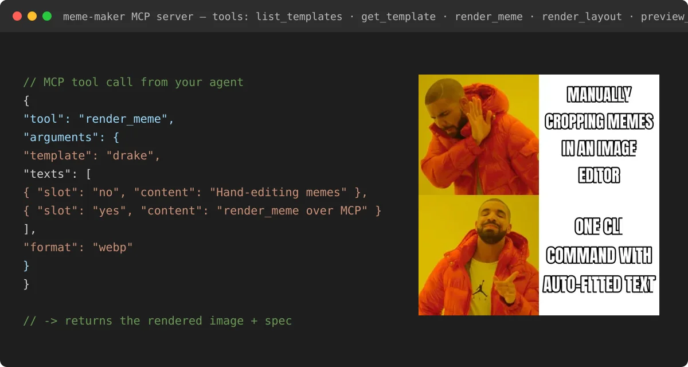

# Meme Lord

> Local-first, deterministic meme generation for autonomous agents — 610 templates, one JSON spec, zero cloud.

[](https://github.com/lovesickness111/meme-lord/actions/workflows/ci.yml)
[](https://github.com/lovesickness111/meme-lord/stargazers)

**Key features**

- **610 curated templates** — 547 static images and 63 animated GIFs, each with named text slots and provenance tracking
- **Deterministic rendering** — the same MemeSpec always produces the same pixels; ideal for tests and reproducible pipelines
- **Four surfaces, one engine** — CLI, MCP server, HTTP/JSON API, and a local web UI, all driven by the same declarative spec
- **Built for agents** — `--json` everywhere, structured errors, machine-readable schemas, sandboxed filesystem access
- **Local-first** — no cloud, no accounts, no telemetry; runs entirely on your machine



## Table of contents

- [What is this?](#what-is-this)
- [60-second quick start](#60-second-quick-start)
- [Examples](#examples)
- [Templates](#templates)
- [CLI](#cli)
- [Web UI](#web-ui)
- [MCP server](#mcp-server)
- [Distribution size & slim installs](#distribution-size--slim-installs)
- [Environment variables](#environment-variables)
- [MemeSpec for agents](#memespec-for-agents)
- [Library](#library)
- [Development](#development)
- [Fonts](#fonts)

## What is this?

Meme Lord is a headless meme generator. You describe a meme as a small JSON document (a **MemeSpec**) — which template, what text in which slot — and it renders a finished PNG, WebP, or GIF.

- **For agents**: call it via the MCP server (`meme-maker-mcp`), the HTTP API, or the CLI with `--json`. Every input is schema-validated (Zod) and every output is machine-readable, so LLMs can discover templates, fill slots, and render without ever seeing a GUI.
- **For humans**: the same engine powers a one-line CLI and a local web UI with a gallery, live-preview editor, render history, and batch mode.



## 60-second quick start

The registry commands below apply after `0.4.0` is published. To use the
current checkout immediately, run `npm pack` and install the generated tarball
with `npm install -g ./agent-meme-maker-0.4.0.tgz`.

```sh
npm install -g agent-meme-maker@0.4.0

meme templates list                                   # browse the catalog
meme render --template drake \
  --text no="MANUAL MEME EDITORS" --text yes="A CLI FOR AGENTS" -o out.png
```

Or run without a global install; npm caches the package after the first invocation:

```sh
npx -y agent-meme-maker@0.4.0 templates suggest \
  "critical irony, stated standard contradicts behavior, two-beat expectation then reality" \
  --min-slots 2 --max-slots 2
```

That's it — `out.png` is a finished meme. Add `--json` to any command for machine-readable output. Update a global npm install with `npm install -g agent-meme-maker@latest`; an `npx` configuration resolves the version written in its command. The standalone curl installer remains available in [docs/INSTALL.md](docs/INSTALL.md).



Working from a clone instead? Run `npm install && npm run build`, then use `node dist/cli.js` wherever the examples say `meme`.

## Examples

Copy-pasteable one-liners for each surface.

**CLI with machine-readable output** — `--json` prints a structured result (path, dimensions, warnings) on stdout:

```sh
meme render --template drake \
  --text no="MANUAL MEME EDITORS" --text yes="A CLI FOR AGENTS" \
  -o drake.png --json
# → { "path": "drake.png", "width": 1200, "height": 1200, "format": "png", ... }
```

**MCP tool call** — send this `tools/call` request to `meme-maker-mcp` (stdio); the `render_meme` arguments are a full [MemeSpec](#memespec-for-agents):

```json
{
  "name": "render_meme",
  "arguments": {
    "base": { "kind": "template", "id": "drake" },
    "texts": [
      { "slot": "no", "text": "MANUAL MEME EDITORS" },
      { "slot": "yes", "text": "AN MCP TOOL FOR AGENTS" }
    ],
    "output": { "path": "drake.png", "format": "png" }
  }
}
```

**HTTP API** — `meme ui` also serves a JSON API; POST the same MemeSpec to `/api/render`:

```sh
curl -s http://127.0.0.1:8787/api/render \
  -H 'Content-Type: application/json' \
  -d '{
    "base": { "kind": "template", "id": "drake" },
    "texts": [
      { "slot": "no", "text": "MANUAL MEME EDITORS" },
      { "slot": "yes", "text": "AN HTTP API FOR AGENTS" }
    ],
    "output": { "format": "png" }
  }'
# → { "base64": "<png bytes>", "width": ..., "height": ..., "warnings": [] }
#   (a "path" field is included when the spec sets output.path)
```

**Web UI** — start the local app (auto-picks a free port), or serve it at a stable named URL with portless:

```sh
meme ui --port 8787        # http://127.0.0.1:8787
npx portless               # https://meme.localhost (see docs/PORTLESS.md)
```

## Templates

610 templates ship in the catalog: 547 static images (drake, distracted-boyfriend, expanding-brain, woman-yelling-at-cat, afraid-to-ask-andy, doge, red-pill-blue-pill, scroll-of-truth, ...) and 63 animated GIFs (mind-blown, deal-with-it, crab-rave, confused-travolta, shrek-running, ...). Provenance for every template is tracked in the `source` fields of `assets/templates/manifest.json` and template sidecars.



Any thumbnails can also be composed into montages with `meme layout`:


The manifest is generated: each template's metadata lives in a `<id>.meta.json` sidecar next to its media file, and `npm run build:manifest` scans `assets/templates/**`, derives file paths and dimensions, validates against the schema, and emits `manifest.json`. Important templates also carry a curated `selectionGuide` describing their visual grammar, good and bad use cases, tone, and caption mechanics. Older/custom templates get an honest runtime guide derived from their tags and slot hints and are marked for preview. `npm run build:thumbs` renders ~320 px webp previews into `assets/templates/thumbs/` plus the contact sheet above.

```sh
meme templates list --json          # full catalog with slots & tags
meme templates show drake --json    # slots + resolved semantic selection guide
meme templates suggest \
  "mocking repetition, quoted claim echoed as a sarcastic reply" --json
```

Each template declares named text slots (e.g. drake has `no` and `yes`) with hints describing what goes where. Non-template bases (canvas, image, layout) accept the convenience slots `top`, `middle`, and `bottom`.

## CLI

```sh
# browse the catalog
meme templates list --json
meme templates show drake

# classic meme in one line
meme render --template drake \
  --text no="MANUAL MEME EDITORS" --text yes="A CLI FOR AGENTS" \
  -o drake.png --json

# blank canvas / custom image / grid layout
meme render --canvas 800x600 --bg '#1e3a5f' --text "HELLO AGENTS" -o hello.png
meme render --image photo.jpg --text "CAPTION" -o captioned.png
meme layout --grid 2x2 --cell a.jpg --cell b.jpg --cell c.jpg --cell d.jpg -o grid.png

# full MemeSpec for advanced styling
meme spec render examples/drake.json

meme fonts list
```



All commands accept `--json` for machine-readable output and `--strict` to treat degraded-render warnings (text overflow, missing glyphs) as errors. Errors are emitted as `{ "error": { "code", "message" } }` with exit code 1.

## Web UI

```sh
meme ui              # starts the local web app; auto-picks a free port
meme ui --port 8787  # or pin one
```

The first stdout line is machine-readable JSON — `{"url":"http://127.0.0.1:PORT"}` — so hosts and agents can discover the URL; a human-readable line follows on stderr.

Prefer a stable named URL over a random port? Run `npx portless` from the repo root to serve the UI at `https://meme.localhost` — see [docs/PORTLESS.md](docs/PORTLESS.md).

The SPA has four surfaces:

- **Gallery** — browse/search all 610 templates with thumbnails
- **Editor** — pick a template, fill slots, live preview, tune slot rects
- **My memes** — render history (stored under `~/.meme-maker/history`, override with `MEME_HISTORY_DIR`)
- **Batch** — render one template with many text variants at once




The same server exposes a JSON API (`/api/templates`, `/api/templates/:id`, `/api/measure`, `/api/render`, `/api/history`). See [docs/UI-DESIGN.md](docs/UI-DESIGN.md) for the full UI/UX spec.

## MCP server

The local stdio server exposes seven tools: `suggest_templates`, `list_templates`, `get_template`, `measure_meme`, `render_meme`, `render_layout`, and `preview_template`.

Template choice is deliberately assigned to the host LLM rather than to a hard-coded phrase router. The intended agent loop is:

1. Codex/Claude turns the user's request into a compact English selection brief: humor mechanic, tone, visual relationship, number of actors/beats, and caption shape.
2. `suggest_templates` retrieves a small candidate set. The LLM compares each candidate's `description`, `bestFor`, `avoidWhen`, `tone`, and visual/text `mechanics`; the highest numeric score is not automatically the winner.
3. `preview_template` when `previewRecommended` is true, then `get_template` for the finalist's slots and defaults.
4. `measure_meme`; rewrite the captions until `status` is `ready`.
5. `render_meme` with `output.onDegrade` set to `"error"`.

Everything runs on the user's machine. A browser is only needed when a human chooses to open the optional local editor.



Install once globally for the fastest startup:

```sh
npm install -g agent-meme-maker@0.4.0
codex mcp add meme-maker -- meme-maker-mcp
claude mcp add --scope user meme-maker -- meme-maker-mcp
```

Or let each host start the pinned npm package through `npx`:

```sh
# macOS / Linux
codex mcp add meme-maker -- npx -y agent-meme-maker@0.4.0 mcp
claude mcp add --scope user meme-maker -- npx -y agent-meme-maker@0.4.0 mcp

# Native Windows: wrap npx with cmd
codex mcp add meme-maker -- cmd /c npx -y agent-meme-maker@0.4.0 mcp
claude mcp add --scope user meme-maker -- cmd /c npx -y agent-meme-maker@0.4.0 mcp
```

Verify with `codex mcp list`, or `claude mcp list` followed by `/mcp` inside Claude Code. The first `npx` launch downloads the roughly 89 MB template catalog, so allow a longer first-start timeout. For Codex, the equivalent explicit configuration is:

```toml
[mcp_servers.meme-maker]
command = "npx"
args = ["-y", "agent-meme-maker@0.4.0", "mcp"]
startup_timeout_sec = 120
required = true
```

`required = true` makes Codex wait for the first cold `npx` download instead of omitting the tool from its initial catalog. On native Windows, use `command = "cmd"` and prefix `args` with `"/c", "npx"`.

Claude Desktop / any other `mcpServers`-style host:

```json
{
  "mcpServers": {
    "meme-maker": {
      "command": "npx",
      "args": ["-y", "agent-meme-maker@0.4.0", "mcp"]
    }
  }
}
```

ACP hosts (e.g. Synara): register `meme-maker-mcp` as a stdio MCP server in the agent's MCP configuration; rendered files land under the output root (`SYNARA_ARTIFACTS_DIR` is respected automatically).

If running from a clone rather than the installer, use `"command": "node", "args": ["/path/to/meme-lord/dist/mcp.js"]`.

`render_meme` takes a full `MemeSpec` and returns the rendered image inline (≤ 1 MB) plus the file path when `output.path` is given.

## Distribution size & slim installs

The full template catalog is ~89 MB. Two options keep installs small:

- **Custom catalog:** point `MEME_TEMPLATES_DIR` (or `--templates-dir`) at any directory
  containing a `manifest.json` + assets.
- **Slim tarball + fetch:** `npm run build:slim-tarball` builds a ~2 MB tarball without
  `assets/templates` (fonts stay bundled), intended as a GitHub Release artifact for a
  `curl -fsSL https://... | sh` installer. On a slim install, run
  `meme templates fetch` to download the template pack from GitHub into
  `~/.cache/meme-maker/templates` (override with `--dest <dir>`, pin a version with
  `--ref <branch|tag|sha>`); it is picked up automatically when no bundled templates
  are present. Requires `tar` on PATH.

`npm run report:assets` prints asset size by pack and flags outlier files.

## Environment variables

| Variable                                                                                                                                                           | Default                 | Purpose                                                                                             |
| ------------------------------------------------------------------------------------------------------------------------------------------------------------------ | ----------------------- | --------------------------------------------------------------------------------------------------- |
| `MEME_OUTPUT_ROOT`                                                                                                                                                 | `./.memes`              | Root directory outputs are confined to on MCP/HTTP surfaces (`SYNARA_ARTIFACTS_DIR` is used if set) |
| `MEME_INPUT_ROOT`                                                                                                                                                  | cwd                     | Root directory input images must resolve under on MCP/HTTP surfaces                                 |
| `MEME_ALLOW_FS`                                                                                                                                                    | unset                   | Set to `1` to allow filesystem image reads on MCP/HTTP surfaces                                     |
| `MEME_TEMPLATES_DIR`                                                                                                                                               | bundled assets          | Use a custom template catalog (also `--templates-dir`)                                              |
| `MEME_HISTORY_DIR`                                                                                                                                                 | `~/.meme-maker/history` | Where `meme ui` stores render history                                                               |
| `MEME_MAX_PIXELS`, `MEME_MAX_INPUT_BYTES`, `MEME_MAX_GIF_FRAMES`, `MEME_MAX_TEXT_LEN`, `MEME_MAX_TOTAL_TEXT_LEN`, `MEME_RENDER_TIMEOUT_MS`, `MEME_MAX_CONCURRENCY` | sane limits             | Resource caps for untrusted inputs                                                                  |

## MemeSpec for agents

Everything renders from one declarative JSON spec — ideal for programmatic generation (see [examples/](examples/)):

```json
{
  "base": { "kind": "template", "id": "drake" },
  "texts": [
    { "slot": "no", "text": "MANUAL MEME EDITORS" },
    { "slot": "yes", "text": "A CLI FOR AGENTS" }
  ],
  "output": { "path": "drake.png", "format": "png" }
}
```

Render it with `meme spec render examples/drake.json` or pass the same shape to the `render_meme` MCP tool. The [examples/](examples/) directory has ready-to-render specs for every base kind (templates, GIFs, custom images, blank canvases, grid layouts) plus a `render-all.mjs` script that renders and verifies them all.

Text boxes can opt into machine-checkable quality limits. `padding` shrinks the drawable
area; the remaining limits emit structured warnings and become hard errors when
`output.onDegrade` is `"error"`:

```json
{
  "slot": "reality",
  "text": "THE DISAPPOINTING REALITY",
  "constraints": {
    "padding": 12,
    "minFontSize": 28,
    "maxLines": 3,
    "maxTextCoverage": 0.65
  }
}
```

Template metadata can define a conservative `safeRect` and default `constraints` for each
slot. A text box may override those defaults. `/api/measure` reports the effective rectangle,
fitted size, line count, coverage, and quality warnings before rasterization.

## Library

The package also exports its local-first library API:

```ts
import { listTemplates, getTemplate, renderMeme } from 'agent-meme-maker';

const out = await renderMeme({
  base: { kind: 'template', id: 'drake' },
  texts: [
    { slot: 'no', text: 'MANUAL EDITORS' },
    { slot: 'yes', text: 'AGENT CLIS' },
  ],
  output: { path: 'out.png' },
});
```

## Development

```sh
npm run build   # tsc + vite (web UI)
npm test        # vitest (unit + golden-image + MCP + HTTP integration)
npm run lint    # eslint + prettier + ui typecheck
npm run test:package # pack, clean-install, audit, CLI/MCP preflight and render smoke test
```

See [docs/README.md](docs/README.md) for the full documentation index: [docs/ARCHITECTURE.md](docs/ARCHITECTURE.md) for the code map, [DESIGN.md](DESIGN.md) and [docs/DESIGN-v2.md](docs/DESIGN-v2.md) for the full design, [docs/CONTRIBUTING.md](docs/CONTRIBUTING.md) for catalog workflows, [docs/PORTLESS.md](docs/PORTLESS.md) for portless/embedded usage, and [docs/ROADMAP.md](docs/ROADMAP.md) for what's next. Template provenance is documented per-entry in `assets/templates/manifest.json` and template sidecars.

## Fonts

Text is rendered with a per-codepoint fallback chain via [opentype.js](https://github.com/opentypejs/opentype.js): [Anton](https://fonts.google.com/specimen/Anton) (display) → [Noto Sans](https://fonts.google.com/noto/specimen/Noto+Sans) → [Noto Emoji](https://fonts.google.com/noto/specimen/Noto+Emoji) (monochrome). Font license texts are retained in `assets/fonts/OFL-*.txt`.
